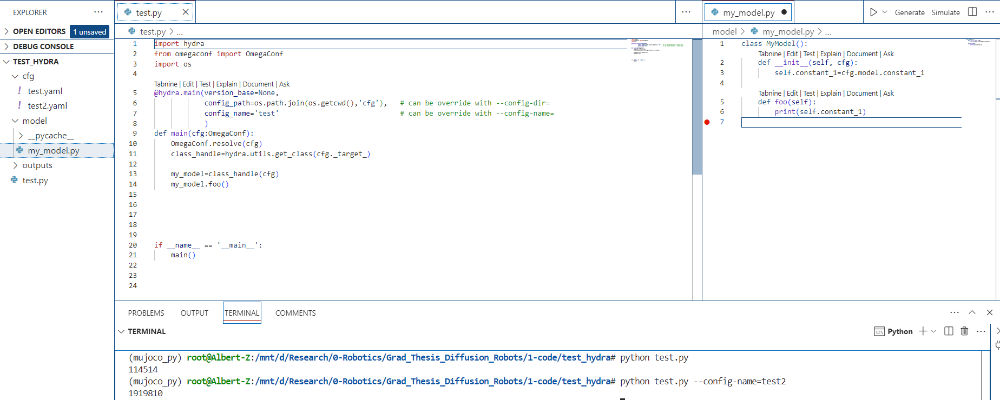

How to use hydra to manage super complex hyperparameter and configuration file systems:



Here, in `test.yaml`, 

```python
_target_: model.my_model.MyModel

model:
  constant_1: 114514
```

In `test2.yaml`

```python
_target_: model.my_model.MyModel

model:
  constant_1: 1919810
```

