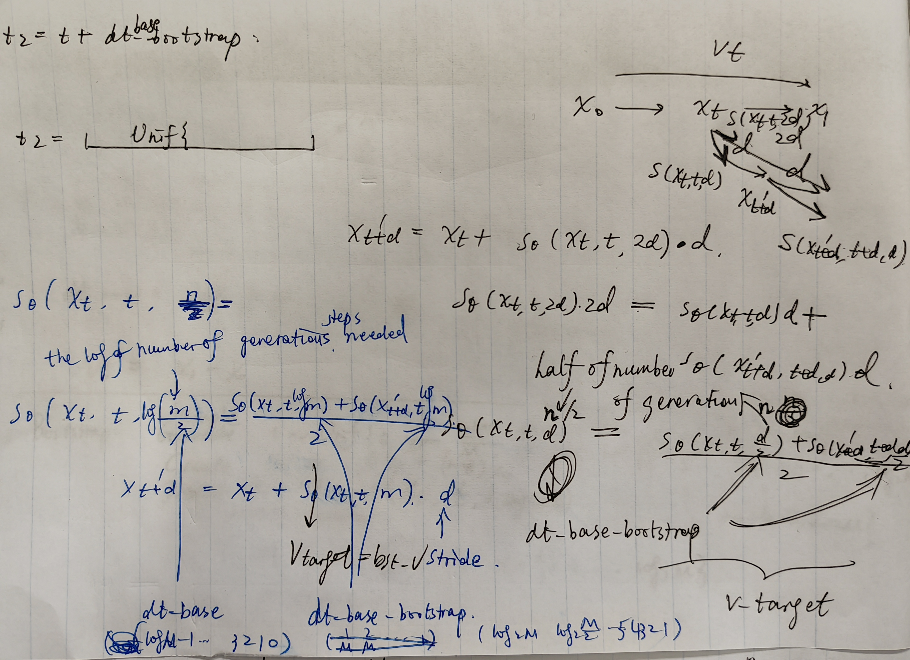

[toc]


| Task        | Sampling  Speed | Optimization  Speed          | Total  env     Steps | Total    Time | Total    Speed           | Reward  Increase                      |
| ----------- | --------------- | ---------------------------- | -------------------- | ------------- | ------------------------ | ------------------------------------- |
| Halfcheetah | 27.46  iter/s   | 0.087  it/s  (11.44  s/iter) | 7.2  x 1e7           | 19h  48m      | 0.013  it/s  (75.57s/it) | +122.095%  (1405.7537  -> 3122.1013)  |
| Hopper      | 27.01  iter/s   | 0.088  it/s  (11.39  s/iter) | 7.2  x 1e7           | 19h  22m      | 0.013  it/s  (74.30s/it) | +  15.603%  (4334.5697  -> 5010.9051) |
| Walker2d    | 30.25 it/s      | 0.086 it/s (11.38s/it)       | 7.2  x 1e7           | 18h 58m       | 0.013 it/s (74.44 s/it)  | +  45.73 % (2672.0042-> 3894.0444)    |


## Bootstrapping (t>0)


`x_0` noise image. 

`x_1`: real image, ground truth

`s_t`: score function of noise-to-image transform. 

`t`: a time index in the stochastic process of denoising. 

`x_t`: the image corrupted by noise with the noise taking weight `t`:

​	$x_t=(1 - t) \times x_0 + t \times x_1$ 

`s_\theta` : flow estimating network

> $s(x_t, t, m)$ is the score function estimate starting at the corrupted image $x_t$ at time $t$, and generates the real image within $m$ steps. 
>
> Basic relation: here $d$ is a short time interval, $m$ is the number of steps to generate an image. 
> $$
> s(x_t,t,2m) \cdot  \frac{dt}{2} +   s\left(x_t^\prime,\ t+\frac{dt}{2},2m\right)\cdot \frac{dt}{2}=s\left(x_t,t,m\right) \cdot  dt \\
> \text{where}\ x_t^\prime = x_t+s(x_t,t,2m)\frac{dt}{2}
> $$
> This is because you will take twice the number of steps to reach the real image if you take twice smaller steps, which is equivalent to saying that
> $$
> s\left(x_t,t,m\right)=
> \frac{1}{2}\left(s(x_t,t,2m) + s\left(x^\prime_t,t+\frac{dt}{2},2m\right)\right)
> $$
> We use a neural network $s_{\theta}$ to approximate the score function. 
>
> For numerical stability, we let the neural net receive the logarithm of generation steps, and name them the `base` of generation steps. 
> $$
> s_{\theta}(x_t,t,\underbrace{\log m}_{\text{base}})\approx s(x_t,t,m)
> $$
> We train the neural nets with temporal consistency by minimizing the bootstrapping error measured by the $\ell_2$ norm:
> $$
> \underset{\theta}{\text{minimize}} \norm{
> s_{\theta}\left(x_t,t,\log_2 m\right)-
> \underbrace{\frac{s_{\theta}(x_t,t,\log_2 2m) +s_{\theta}\left(x^\prime_t,t+\frac{dt}{2},\log_2 2m\right)}{2}}_{\text{bootstrap target}}
> }_2^2
> $$

`M`: maximum number of denoising steps to generate a picture. 


`dt_sections`: number of steps to generate a picture, `m=1,2,4,8,...M/2`.  

`dt`: the time taken by each denoising step to generate a picture using `dt_sections` steps within unit time. 

​	`dt=1/dt_section=1/m=1,1/2,1/4,1/8,...2/M`

`dt_base`: the logarithm of `dt_sections` to the base `2`: 

​	`dt_base=`$\log_2$`dt_sections`=`log_2 m=0,1,2,3,...`$\log_2\frac{M}{2}$	 . 


`dt_sections_bootstrap`: number of steps to generate a picture with a bootstrap, `2m=2,4,8,16,...M`.  

`dt_bootstrap`: the time taken by each denoising step to generate a picture with two bootstrap steps within unit time. , `dt_bootstrap=1/dt_sections_bootstrap=dt/2=1/2,1/4,1/8,1/16,...1/M`.

`dt_base_bootstrap`: the logarithm of `dt_sections_bootstrap` to the base `2`: 

​	`dt_base_bootstrap=`$\log_2$`dt_sections_bootstrap`=`dt_base+1=log_2(2m)=1,2,3,4,...`$\log_2 M$ 

Then we have
$$
\log_2 m=\text{dt\_base}\\
\log_2 2m=\text{dt\_base\_bootstrap}\\
\frac{dt}{2}=\text{dt\_bootstrap}
$$
Denote the bootstrapped velocities (score) as 
$$
\begin{equation}
\begin{aligned}
v_{b1}=&s_{\theta}\left(x_t,t,\log_2 2m\right)=s_{\theta}\left(x_t,t,\text{dt\_base\_bootstrap}\right)\\
x_{t2}=&x_t^\prime=x_t+s_{\theta}(x_t,t,\log_2 m ) \cdot \frac{dt}{2} = x_t+ v_{b_1} \cdot \text{dt\_bootstrap} \\
t_2 = & t+ \frac{dt}{2}= t + \text{dt\_bootstrap}\\ 
v_{b2}=&s_{\theta}\left(x^\prime_t,t+\frac{dt}{2},\log_2 2m\right) =s_{\theta}(x_{t_2},t_2, \text{dt\_base\_bootstrap})\\
v_{\text{target}}=&\frac{s_{\theta}\left(x^\prime_t,t+\frac{dt}{2},\log_2 2m\right)}{2}=\frac{v_{b_1}+v_{b_2}}{2}
\end{aligned}
\end{equation}
$$
So we will get this realization,

```python
v_b1 = call_model_fn(x_t, t, dt_base_bootstrap, bst_labels, train=False)
t2 = t + dt_bootstrap

x_t2 = x_t + dt_bootstrap[:, None, None, None] * v_b1
x_t2 = np.clip(x_t2, -4, 4)

v_b2 = call_model_fn(x_t2, t2, dt_base_bootstrap, bst_labels, train=False)
v_target = (v_b1 + v_b2) / 2
```


And the direct estimation of the flow is realized as
$$
v_t=s_{\theta}\left(x_t,t,\log_2 m\right)=s_{\theta}(x_{t_2},t_2, \text{dt\_base})
$$
And this is obtained via 

```python
v_prime, logvars, activations = self.network(x_t, t, dt_base, labels,
                                             train=True,
                                             rngs={'dropout': self.dropout_key},
                                             params=grad_params, 
                                             return_activations=True)
```


In the end you calculate the bootstrapped error via

```python
mse_v = np.mean((v_prime - v_t) ** 2, axis=(1, 2, 3))
loss = np.mean(mse_v)
```


## Flow-matching (t=0)


Generate $t\sim \mathrm{Unif}\left\{0,\frac{1}{M},\frac{2}{M},\ldots,1-\frac{1}{M}\right\}$

```python
t = jax.random.randint(time_key, (images.shape[0],), minval=0, maxval=FLAGS.model['denoise_timesteps']).astype(np.float32)

t /= FLAGS.model['denoise_timesteps']
t_full = t[:, None, None, None] # [batch, 1, 1, 1]
```


Generate purse noise and real image, then mix them with ratio $t$. 
$$
x_t = t \cdot x_1 + (1-t)\cdot x_0
$$

```python
x_0 = jax.random.normal(noise_key, images.shape)
x_1 = images
x_t = x_t = (1 - (1 - 1e-5) * t_full) * x_0 + t_full * x_1
```

The real velocity (linear path from noise to real image) is 
$$
v_t = x_1 -  x_0
$$

```python
v_t = v_t = x_1 - (1 - 1e-5) * x_0
```

Time and generation step for rectified flow,

```python
dt_flow = np.log2(FLAGS.model['denoise_timesteps']).astype(np.int32)
dt_base = np.ones(images.shape[0], dtype=np.int32) * dt_flow
```

And the flow matching loss is


​	

For bootstrap targest, 

```python
x_1 = images[:bootstrap_batchsize]
```

For flow matching, 

```python
flow_size = FLAGS.batch_size - bootstrap_batchsize  
xt_flow=x_t[:flow_size]
```


Finally we concatenate them to form the outputs of `get_targets`. 

```python
x_t = np.concatenate([xt_bst, xt_flow], axis=0) # the corrupted images
t = np.concatenate([t_bst, t_flow], axis=0)     # random time index, which determins the corruption ratio
dt_base = np.concatenate([dtbase_bst, dt_base_flow], axis=0) # log_2 m of denoising steps using shortcuts
v_t = np.concatenate([v_bst, v_flow], axis=0)   # bootstraped targets and the linear path as supervision
labels_dropped = np.concatenate([l_bst, l_flow], axis=0)   # labels of x1, which generates corrupt images
```


So this function only generates supervision signals. 

And forward call to the DiT generates the neural net’s guess, for the flow `v'`. 

```python
v_prime, logvars, activations = train_state.call_model(x_t, t, dt_base, labels, train=True, rngs={'dropout': dropout_key}, params=grad_params, return_activations=True)
```

> In the DiT model, `t`, `dt_base`, and `labels` are transformed into embeddings and send to transformer blocks with `x_t`. 


Loss calculation

```python
def loss_fn(grad_params):
    v_prime, logvars, activations = train_state.call_model(x_t, t, dt_base, labels, 
                                                           train=True, 
                                                           rngs={'dropout': dropout_key}, 
                                                           params=grad_params, return_activations=True)
    mse_v = jnp.mean((v_prime - v_t) ** 2, axis=(1, 2, 3))
    loss = jnp.mean(mse_v)
```


## Inference

### One-step generation

Pick `t=1-dt` and do one integration with `dt=1/M`. 

```python
if FLAGS.model.denoise_timesteps == 128:
    dt_base = jnp.array([0,1,2,3,4,5,6,7]) 
    # Here we generate multiple pictures in parallel, 
    # starting as noisy image generated at various time t, 
    # but all of them uses 1 step to convert noisy image to clean image. 
    dt = 2.0 ** (-dt_base)
    # [1,1/2,1/4,1/8,1/16,...,1/128]
    t = 1 - dt

# create x_t at t=1-dt corrupted at the last step.
x_t = (1 - (1 - 1e-5) * t_full) * eps_tile + t_full * valid_images_tile
x_t, t, dt_base = shard_data(x_t, t, dt_base)

# predict the flow at the last steps
v_pred = call_model(train_state, x_t, t, dt_base, valid_labels_sharded if FLAGS.model.cfg_scale != 0 else labels_uncond)

# take one integration step: x1 = xt + v dt
x_1_pred = x_t + v_pred * (1-t[..., None, None, None])
```


### Few step generation:

```python
denoise_timesteps_list = [1, 2, 4, 8, 16, 32]
if FLAGS.model.denoise_timesteps == 128:
    denoise_timesteps_list.append(128)
for denoise_timesteps in denoise_timesteps_list:
    do_cfg = False
    if denoise_timesteps == 'cfg':
        denoise_timesteps = denoise_timesteps_list[-2]
        do_cfg = True
    all_x = []
    delta_t = 1.0 / denoise_timesteps
    x = eps # [local_batch, ...]
    x = shard_data(x) # [batch, ...] (on all devices)
    
    for ti in range(denoise_timesteps):
        t = ti / denoise_timesteps # From x_0 (noise) to x_1 (data)
        t_vector = jnp.full((eps.shape[0],), t)
        dt_base = jnp.ones_like(t_vector) * np.log2(denoise_timesteps)
        t_vector, dt_base = shard_data(t_vector, dt_base)
        
        v = call_model(train_state, x, t_vector, dt_base, 
                       visualize_labels if FLAGS.model.cfg_scale != 0 else labels_uncond)
        x = x + v * delta_t
```


## References

#### Training: 


 


#### Inference: 


